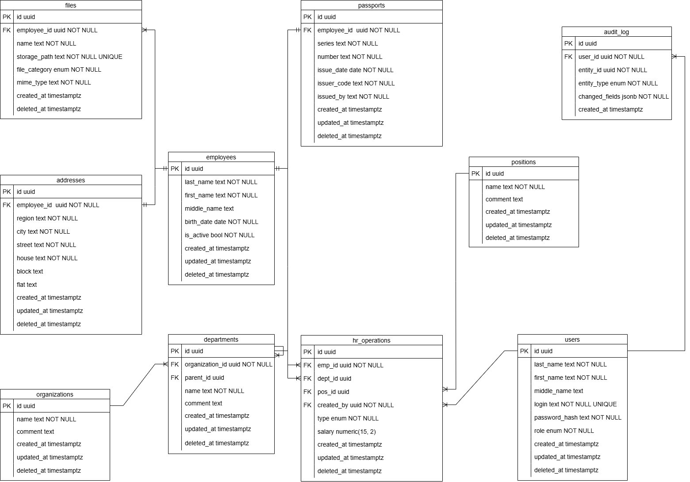

# Учет сотрудников

Веб-приложение для ведения кадрового учета сотрудников в нескольких организациях.

## Окружение разработки

- **ОС:** Windows 10 с WSL2
- **IDE:** Visual Studio Code
- **СУБД:** PostgreSQL 17 через Docker Compose
## Технологический стек

- **Frontend:** Vue.js 3.5, Quasar Framework, Vite 
- **Backend:** Node.js 22, NestJS 11
- **Database:** PostgreSQL 17
- **Storage:** MinIO
- **Authentication** Argon2id, Passport Local Strategy 
- **Documentation:** VitePress, Draw.io (ERD)
- **Deployment:** Docker, Docker Compose, Nginx, Git/Github

## Библиотеки

-   `pg` — основной драйвер для работы с PostgreSQL.
-   `node-pg-migrate` — управление миграциями структуры БД.
-   `@nestjs/passport` — модуль для идентификации и аутентификации.
-   `joi` — валидация входящих данных.
-   

## Схема базы данных (ERD)

*Для начала работы перейдите в раздел [Установка и запуск](/docs#установка-и-запуск).*

